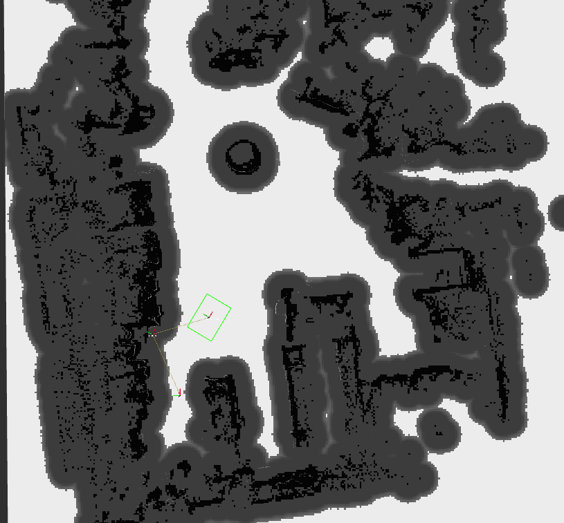
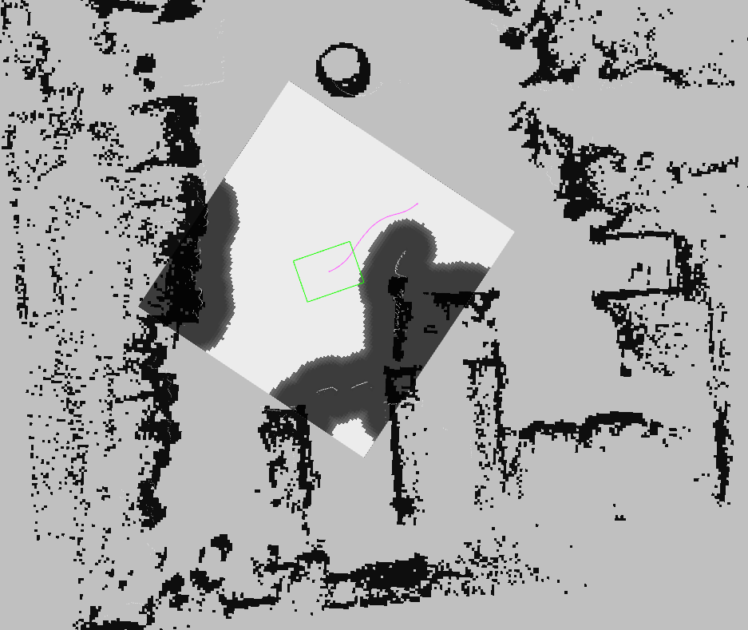
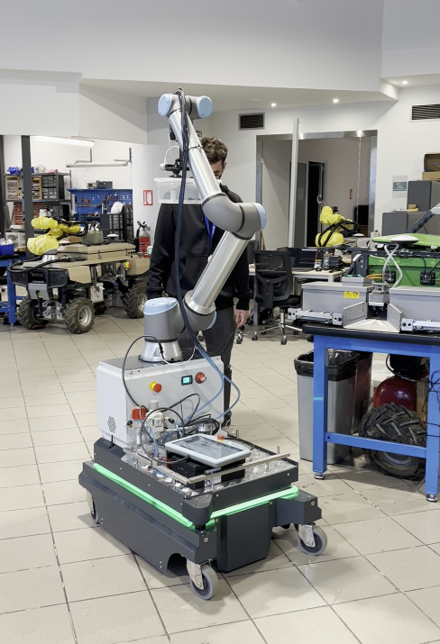

# kiro_nav — Social-Aware Navigation for Mobile Robots (ARISE-KIRO)


`kiro_nav` is the **Social-Aware Navigation** reusable module of the **KIRO** experiment (ARISE
1st Open Call). It is a ROS 2 / Vulcanexus containerized **Nav2 stack** using the
[CoHAN-Nav2](https://github.com/sphanit/CoHAN-Nav2) HATeb local planner, enabling a mobile robot
to navigate safely around workers in shared industrial spaces. Instead of treating pedestrians as
static costmap obstacles, HATeb models each tracked worker as a dynamic agent and optimises a
trajectory that avoids both physical collision and socially uncomfortable proximity. Human tracking
data arrives in standard **ROS4HRI** format and is converted internally before reaching CoHAN.

- **Inputs:** `/humans/persons/tracked` (`hri_msgs/IdsList`) + `/humans/persons/<id>/position`
  (`hri_msgs/PointOfInterest3DStamped`) — standard ROS4HRI human tracking; `/map`, `/tf`,
  odometry, `/scan_raw` — from the robot's own localization/sensor stack.
- **Output:** `/cmd_vel` (`geometry_msgs/Twist`) — socially-aware velocity commands.
- **Capability delivered:** off-the-shelf human-aware local planning and obstacle avoidance for a
  differential-drive mobile robot — tested at IKH's production facility with zero collisions.

> **New here?** Read this README top-to-bottom, then the detailed pages under
> [`docs/`](docs/). The quickest check that everything installed is the
> [hello world](docs/03_installation_and_hello_world.md) (no robot needed); to see the robot navigating around
> pedestrians in a simulated environment, run the [demo](docs/04_basic_demo_how_to_use.md).

---

## Connection with ARISE

This module is the open implementation of `kiro_nav`, the social navigation container in the KIRO
TRL6-7 demonstrator. Whenever the KIRO mission controller's FSM needs the robot to move
(`NavToWarehouseState`, `NavToHomeState`, `NavToTargetState`), it sends a `NavigateToPose` goal
here. `kiro_nav` returns `SUCCEEDED` or `ABORTED`; the social awareness happens inside HATeb,
invisibly to the caller.

- **ROS 2 / Vulcanexus:** the module runs on **Vulcanexus Humble** and exposes its capability
  purely over standard ROS 2 interfaces (one Nav2 action + ROS4HRI subscriptions over Fast DDS).
  See [`docs/02_interfaces.md`](docs/02_interfaces.md).
- **ROS4HRI / ROS4RI:** ✅ applied. Human tracks arrive in ROS4HRI format and are converted by an
  internal `hri_to_cohan_bridge` (`src/bridge/`). The `PointOfInterest3DStamped` message type was
  proposed and contributed upstream to `hri_msgs` as part of this work.
- **FIWARE / NGSI-LD, DDS enabler:** **not applicable to this module** — navigation is a
  real-time ROS 2 subsystem; FIWARE integration operates centrally in KIRO at mission level. The
  full justification (and a candidate NGSI-LD mapping) is in
  [`docs/02_interfaces.md`](docs/02_interfaces.md#arise-middleware-interfaces--applicability).

This work is part of KIRO, co-funded by the European Union under the Horizon Europe **ARISE**
project (Grant Agreement No. 101135784).


Screenshots from the real IKH deployment:

<table>
<tr>
<td align="center"><br/><em>Global costmap — robot footprint in the warehouse</em></td>
<td align="center"><br/><em>Local costmap — social-cost zone around a tracked worker, plan routing around it</em></td>
<td align="center"><br/><em>The physical robot on the IKH shop floor</em></td>
</tr>
</table>

A quick demonstrator video: [KIRO full system demonstration](https://www.youtube.com/watch?v=uGGcSsZhrGk).

[](https://www.youtube.com/watch?v=uGGcSsZhrGk "Watch the KIRO on YouTube")

**Running against a real robot:** ensure `/map`, `/tf`, `/mobile_base_controller/odom`, and
`/scan_raw` are visible on the network, start the KIRO Human Detection module (or any other
ROS4HRI-compliant source), then run `./run.sh` (without `--sim`). Review `config/nav_cohan.yaml`
for frame names and topic remaps matching your robot.

---


## Repository layout

```
kiro_nav/
├── README.md
├── LICENSE                       MIT
├── run.sh                        Build + launch entry point (--shell, --sim, --no-build)
├── docs/                         ARISE context, interfaces, install, demo, demonstrator role
│   ├── 01_arise_context.md
│   ├── 02_interfaces.md
│   ├── 03_installation_and_hello_world.md
│   ├── 04_basic_demo_how_to_use.md
│   └── 05_role_in_demonstrator.md
├── config/
│   ├── nav_cohan.yaml            Nav2 + HATeb + costmap parameters
│   └── goals.yaml                agent_path_prediction placeholder
├── launch/
│   ├── cohan_nav2.launch.py      Main Nav2 + CoHAN launch
│   ├── hri_to_cohan_bridge.launch.py
│   └── launch.sh                 Container entrypoint wrapper
├── src/bridge/
│   └── hri_to_cohan_bridge.py    ROS4HRI → cohan_msgs/TrackedAgents converter
├── examples/
│   ├── run_demo.sh               One-command two-container demo
│   └── run_demo.md               Step-by-step manual walkthrough
├── docker/
│   ├── Dockerfile
│   ├── entrypoint.sh
│   └── docker-compose.yml
└── media/                        Architecture diagram, screenshots, video link
```

## Known limitations

- **Simulated localization is imperfect** and may occasionally interfere with navigation. This is only a limitation in the simulated environment provided. Occasional
  recoveries (`number_of_recoveries > 0`) are expected and do not indicate failure — the goal still
  completes.
- **HATeb assertion under dynamic replanning:** the optimizer can intermittently raise
  `Assertion failed: Adding a timediff requires a positive dt` when a pedestrian crosses very close
  to the robot's path, triggering a Nav2 recovery rather than a smooth avoidance maneuver. This is
  a known upstream timing edge case; the goal still completes.
- **Proprietary/commercial boundary:** none — this is a fully open implementation.

## Maintainer, contact & citation

- **Maintainer:** Andreas Vatistas ([@andvatistas](https://github.com/andvatistas)).
- **Project contacts (IKNOWHOW SA):** Maria Kampa <mkampa@iknowhow.com>.
- **Acknowledgement:** developed in the KIRO experiment, co-funded by the European Union under the
  Horizon Europe ARISE project (GA 101135784). Demonstrator video:
  [youtube.com/watch?v=uGGcSsZhrGk](https://www.youtube.com/watch?v=uGGcSsZhrGk).

## License

MIT License — see [LICENSE](LICENSE).

**Copyright owner:** ATHENA RC (KIRO partner), on behalf of the KIRO experiment within the ARISE project (Horizon Europe GA 101135784).

**Third-party licenses:**

| Dependency | License |
|---|---|
| [CoHAN-Nav2 / HATeb](https://github.com/sphanit/CoHAN-Nav2) | Apache-2.0 |
| [Nav2](https://github.com/ros-navigation/navigation2) | Apache-2.0 |
| [hri_msgs](https://github.com/ros4hri/hri_msgs) | Apache-2.0 |
| [ROS 2 / Vulcanexus packages](https://docs.vulcanexus.org) | Apache-2.0 |
| [Gazebo Classic](https://classic.gazebosim.org) (examples only) | Apache-2.0 |
| [HuNavSim](https://github.com/robotics-upo/hunav_sim) (examples only) | Apache-2.0 |
