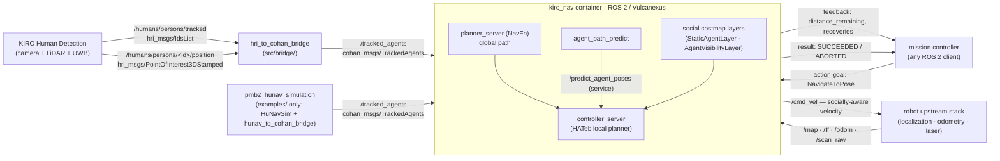
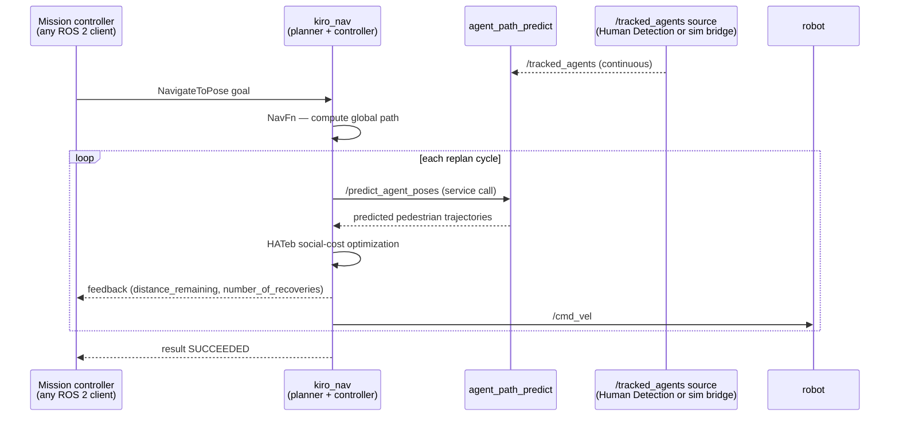

# kiro_nav — Architecture & data flow

## Component / data-flow diagram

How `kiro_nav` fits between the robot's upstream stack and a mission controller.

`kiro_nav` does not care which `/tracked_agents` source is active — the internal stack is unchanged regardless.

---

## Sequence — a `NavigateToPose` goal

